# Description du projet

Ce projet est essentiellement un challenge technique où l'on vous demande de produire le code serveur (exposé via des API REST) responsable à gérer les questions / réponses dans une base de connaissances (FAQ) du produit. Et qui doit répondre au cas d'usages suivants:

> En tant qu'utilisateur ayant les droits "administrateur", je peux insérer une question / réponse dans la base de connaissances (FAQ) du produit. Une question / réponse est définie par :
> 1. Le libellé de la question ;
> 0. Le libellé de la réponse ;
> 0. La liste des tags associés.

> En tant qu'utilisateur ayant les droits "administrateur", je peux lister toutes les questions / réponses de la base de connaissances.

> En tant qu'utilisateur, je peux rechercher la réponse à une question sans avoir à saisir le texte exact correspondant à une question ou à une réponse de la base de connaissances. Note : la solution devra reposer sur l'utilisation du SGBD.

## Table of matières

- [Outils](#outils)
- [Usage](#usage)
- [Postman](#postman)


## Outils
Ce projet a été réalisé en utilisant le framework open source Spring (version: 3.0.0), MySQL pour la BD et assemblé via Gradle.

## Usage
Etapes pour lancer le projet:
1. Créer une connexion sur MySQL workbench avec un username: root et un mot de passe: root, port: 3306
2. Créer un Schema au niveau de cette connexion appelé netheos
3. Lancer un build --> Run du projet (ceci va lancer le serveur et créer tous les tables dans la BD netheos)
4. Au niveau du table role, on doit créer les 2 roles suivants: 
id: 1 - name: ROLE_USER
id: 2 - name: ROLE_ADMIN
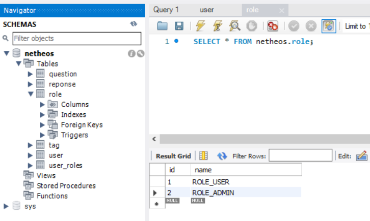
5. Creer un nouvel utilisateur avec le role "admin" en utilisant Postman 
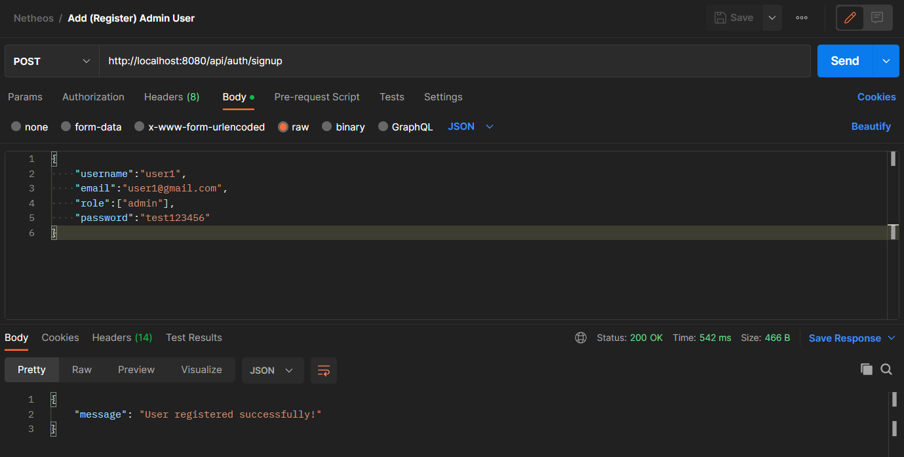
6.Signin avec le nouvel admin en utilisant Postman (Ceci va générer un nouveau Token)
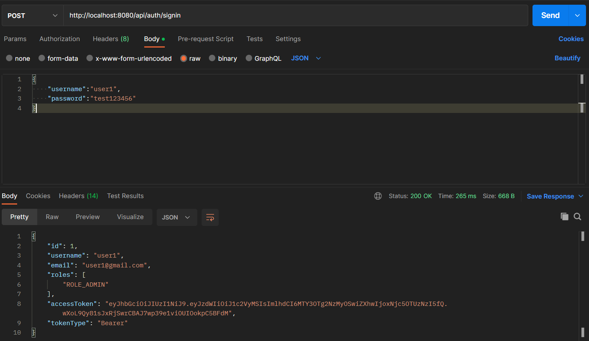
7. On peut tester le role de l'utilisateur connecté avec postman, en utilisant le token créé lors de l'authentification
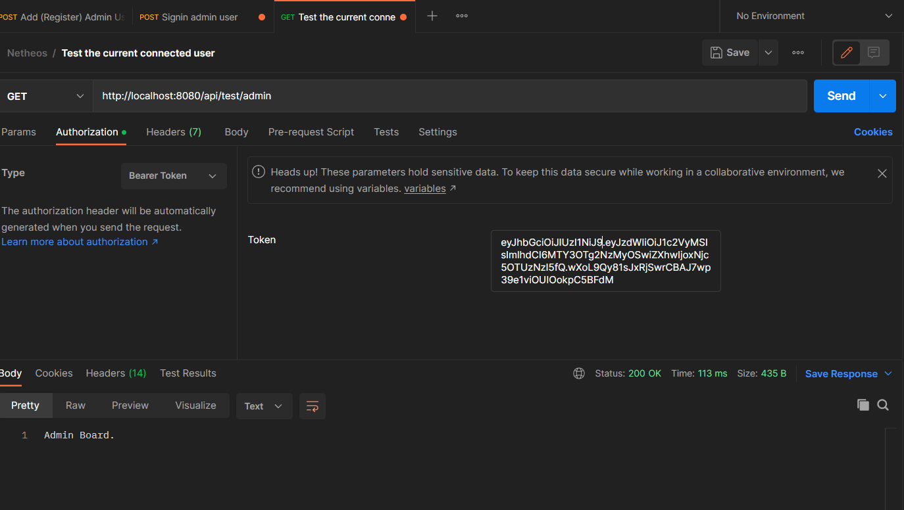
8. Pour l'ajout des questions, on doit tout d'abord ajouter une liste des tags à la BD
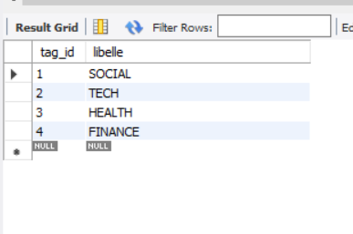
9. Par la suite, sur Postman, on doit ajouter le Bearer Token de l'utilisateur connecté à la partie "Authorization" ainsi que le body de la question
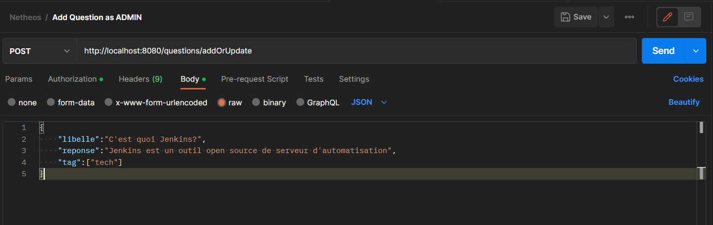
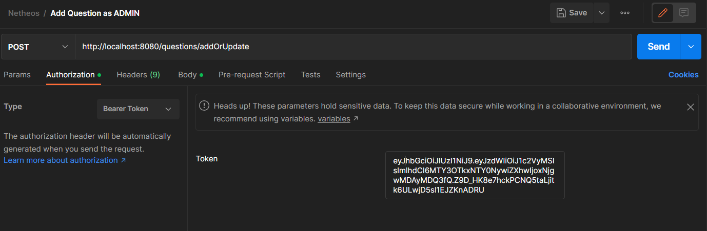
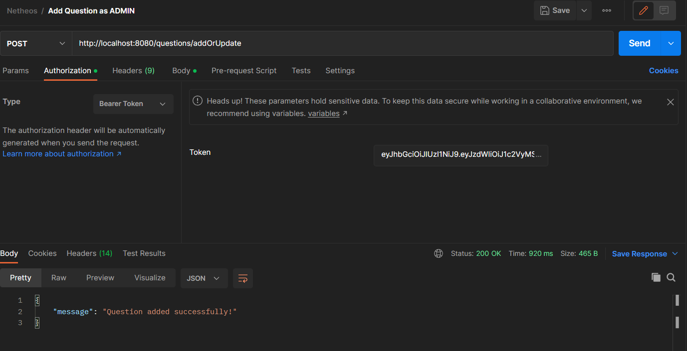
Et bien sur sans le token (sans authentification) on aura une erreur
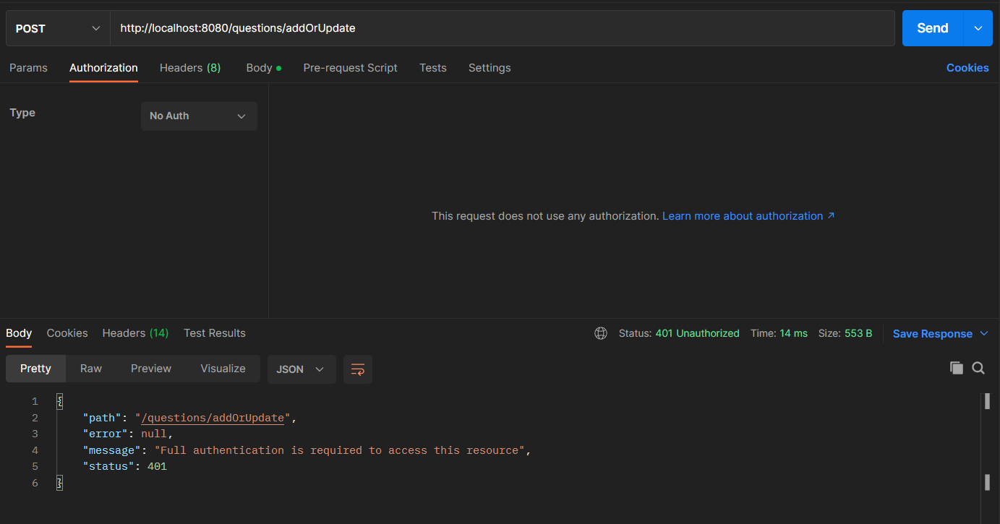
10. De même pour lister toutes les questions dans la BD, l'utilisateur doit avoir le role admin, donc au niveau de postman, on doit ajouter le token de l'utilisateur connecté à la partie Authorization pour pouvoir lister toutes les questions. 
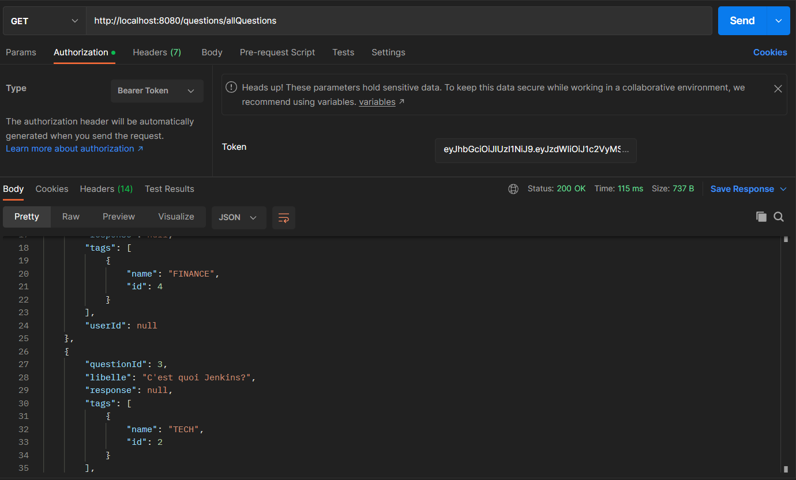
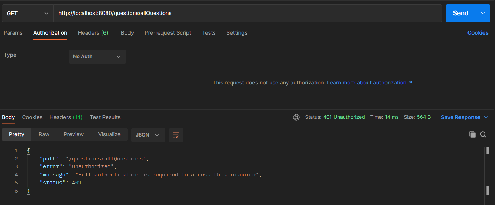
11. Pour chercher une question specifique, il suffit d'utiliser l'url de l'api suivant ```http://localhost:8080/questions/SearchSpecific?word=<mot>``` en changeant ```<mot>``` par le mot clé voulu pour la recherche 
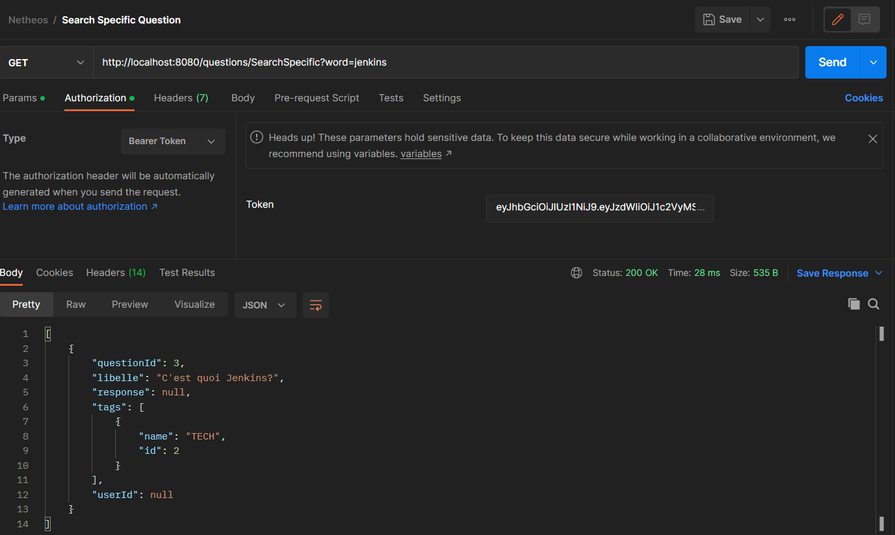

## Postman
Vous pouvez consulter la liste de requêtes pour tester les api via postman dans le fichier ```Netheos.postman_collection```